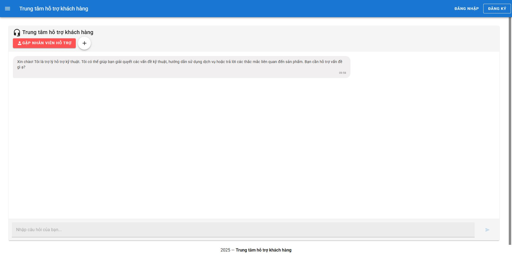
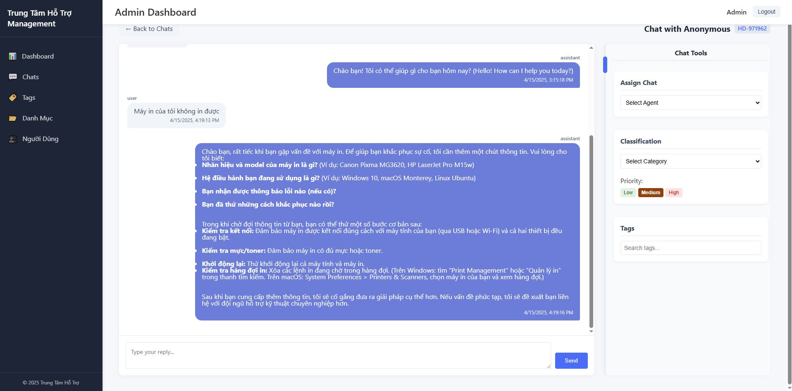

# Open source AI Helpdesk Support System

An open source AI-based helpdesk support system with a focus on chat functionality, designed to provide intelligent customer support with human agent integration. Featuring advanced knowledge management capabilities powered by Elasticsearch, Gemini AI, and vector search technologies for superior response accuracy and efficiency.

# Give me a ⭐ star on [GitHub repo](https://github.com/chungnn/ai-chat365) to keep improving this project! 💖

## Features
- AI-powered chat support for customer inquiries using Google's Gemini models
- Advanced knowledge management system leveraging Elasticsearch and vector search
- Semantic search capabilities for accurate information retrieval
- Easy knowledge base management with automated indexing and relevance tuning
- Live agent handoff when AI can't resolve issues
- Ticket management and tracking system
- Comprehensive analytics and reporting on support metrics
- **NEW**: Enhanced security with RS256 JWT authentication
- **NEW**: Full multi-language support throughout the application

## Project Structure
This project consists of four main components:
- **/end-user-api**: Backend API for end-users
- **/end-user-ui**: Frontend application for end-users
- **/mgmt-api**: Backend API for management/administration
- **/mgmt-ui**: Frontend application for management/administration

## Getting Started

### Prerequisites
- Node.js (v16 or higher)
- MongoDB
- Elasticsearch (for knowledge base functionality)
- Redis (optional, for enhanced real-time functionality)
- GEMINI API KEY (obtain from [Google AI Studio](https://makersuite.google.com/app/apikey))

### Installation

1. Clone the repository:
    ```powershell
    git clone https://github.com/chungnn/ai-chat365.git
    cd ai-chat365
    ```

2. Set up the end-user API:
    ```powershell
    cd end-user-api
    npm install
    # Generate RSA key pair for JWT authentication
    node generate-keys.js
    # Configure your .env file based on the example
    npm run dev
    ```

3. Set up the end-user UI (in a new terminal):
    ```powershell
    cd end-user-ui
    npm install
    npm run serve
    ```

4. Set up the management API (in a new terminal):
    ```powershell
    cd mgmt-api
    npm install
    # Configure your .env file based on the example
    npm run dev
    ```

5. Set up the management UI (in a new terminal):
    ```powershell
    cd mgmt-ui
    npm install
    npm run serve
    ```

## Knowledge Management
Each component has its own configuration needs. Refer to the README files in each directory for specific configuration details.

## Knowledge Management System
The AI Helpdesk Support System features a sophisticated knowledge management system powered by:

### Elasticsearch Integration
- Full-text search with high performance and scalability
- Custom analyzers for multiple languages
- Automated indexing of knowledge base articles
- Faceted search capabilities for filtering results

### Vector Search Capabilities
- Document embeddings to capture semantic meaning
- Similarity search for finding related content
- Hybrid search combining keywords and semantic similarity
- Support for multilingual content discovery

### Gemini AI Integration
- Contextual understanding of user queries
- Advanced RAG (Retrieval Augmented Generation) implementation
- Query refinement to improve search accuracy
- AI-powered knowledge gap detection

### Easy Administration
- User-friendly interface for knowledge base management
- Automated content categorization
- Performance analytics on knowledge base usage

## Recent Updates
- **Enhanced Security**: Implemented RS256 JWT authentication using RSA key pairs for more secure token generation and validation
- **Multi-language Support**: Added comprehensive internationalization (i18n) throughout the application, with initial support for English and Vietnamese languages
- **Improved UI Components**: Refactored UI components to use translation keys instead of hard-coded text

## Contributing
This is an open source project and contributions are welcome! Please read the [CONTRIBUTING.md](CONTRIBUTING.md) file for guidelines on how to contribute to this project.

## Screenshots
Below are some screenshots of the AI Helpdesk Support System in action:





## License
This project is licensed under the MIT License - see the [LICENSE](LICENSE) file for details.

## Custom Solutions
Need a tailored solution for your organization? Contact us for customization services:
- Facebook: [fb.com/chungnn](https://fb.com/chungnn)
- Telegram: [@TE_chungnn](https://t.me/TE_chungnn)
- LinkedIn: [Chung Nguyễn](https://www.linkedin.com/in/chungnn-8b074b44/)